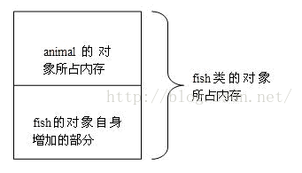
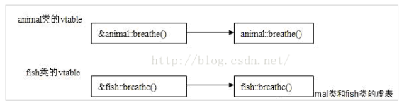

```c++
//例1-1
#include <iostream.h>  
class animal  
{  
public:  
       void sleep()  
       {  
              cout<<"animal sleep"<<endl;  
       }  
       void breathe()  
       {  
              cout<<"animal breathe"<<endl;  
       }  
};  
class fish:public animal  
{  
public:  
       void breathe()  
       {  
              cout<<"fish bubble"<<endl;  
       }  
};  
void main()  
{  
       fish fh;  
       animal *pAn=&fh; // 隐式类型转换  
       pAn->breathe();  
}  
```

程序中没有定义虚函数。以下是程序执行的结果：

答案是输出：animal breathe

我们在main()函数中首先定义了一个fish类的对象fh，接着定义了一个指向animal类的指针变量pAn，将fh的地址赋给了指针变量pAn，然后利用该变量调用pAn->breathe()。

往往将这种情况和C++的多态性搞混淆，认为fh实际上是fish类的对象，应该是调用fish类的breathe()，输出“fish bubble”，然后结果却不是这样。

下面我们从两个方面来讲述原因。

1、 编译的角度

C++编译器在编译的时候，要确定每个对象调用的函数（要求此函数是非虚函数）的地址，这称为早期绑定（early binding），当我们将fish类的对象fh的地址赋给pAn时，

C++编译器进行了类型转换，此时C++编译器认为变量pAn保存的就是animal对象的地址。当在main()函数中执行pAn->breathe()时，调用的当然就是animal对象的breathe函数。

2、 内存模型的角度

我们给出了fish对象内存模型，如下图所示：



我们构造fish类的对象时，首先要调用animal类的构造函数去构造animal类的对象，然后才调用fish类的构造函数完成自身部分的构造，从而拼接出一个完整的fish对象。

当我们将fish类的对象转换为animal类型时，该对象就被认为是原对象整个内存模型的上半部分，也就是图中的“animal的对象所占内存”。

那么当我们利用类型转换后的对象指针去调用它的方法时，当然也就是调用它所在的内存中的方法。因此，输出animal breathe，也就顺理成章了。


前面输出的结果是因为编译器在编译的时候，就已经确定了对象调用的函数的地址，要解决这个问题就要使用迟绑定（late binding）技术。

当编译器使用迟绑定时，就会在运行时再去确定对象的类型以及正确的调用函数。而要让编译器采用迟绑定，就要在基类中声明函数时使用virtual关键字（注意，这是必须的），这样的函数我们称为虚函数。

**一旦某个函数在基类中声明为virtual，那么在所有的派生类中该函数都是virtual，而不需要再显式地声明为virtual。**

下面修改以上的代码，将animal类中的breathe()函数声明为virtual，如下：

```c++
//例1-2
#include <iostream.h>  
class animal  
{  
public:  
 void sleep()  
 {  
  cout<<"animal sleep"<<endl;  
 }  
 virtual void breathe()  
 {  
  cout<<"animal breathe"<<endl;  
 }  
};  
class fish:public animal  
{  
public:  
 void breathe()  
 {  
  cout<<"fish bubble"<<endl;  
 }  
};  
void main()  
{  
 fish fh;  
 animal *pAn=&fh; // 隐式类型转换  
 pAn->breathe();  
}  
```

再次运行这个程序，你会发现结果是“fish bubble”，也就是根据对象的类型调用了正确的函数。

那么当我们将breathe()声明为virtual时，在背后发生了什么呢？

编译器在编译的时候，发现animal类中有虚函数，此时**编译器会为每个包含虚函数的类创建一个虚表（即vtable），该表是一个一维数组，在这个数组中存放每个虚函数的地址**。

animal和fish类都包含了一个虚函数breathe()，因此编译器会为这两个类都建立一个虚表，（即使子类里面没有virtual函数，但是其父类里面有，所以子类中也有了）如下图所示：



**那么如何定位虚表呢？**

**编译器另外还为每个类的对象提供了一个虚表指针（即vptr）**，这个指针指向了对象所属类的虚表。

**在程序运行时，根据对象的类型去初始化vptr，从而让vptr正确的指向所属类的虚表，从而在调用虚函数时，就能够找到正确的函数。**对于修改后的程序，由于pAn实际指向的对象类型是fish，因此vptr指向的fish类的vtable，当调用pAn->breathe()时，根据虚表中的函数地址找到的就是fish类的breathe()函数。

正是由于每个对象调用的虚函数都是通过虚表指针来索引的，也就决定了虚表指针的正确初始化是非常重要的。换句话说，在虚表指针没有正确初始化之前，我们不能够去调用虚函数。

**那么虚表指针在什么时候，或者说在什么地方初始化呢？**

答案是在构造函数中进行虚表的创建和虚表指针的初始化。

还记得构造函数的调用顺序吗，**在构造子类对象时，要先调用父类的构造函数，此时编译器只“看到了”父类，并不知道后面是否后还有继承者，它初始化父类对象的虚表指针，该虚表指针指向父类的虚表。当执行子类的构造函数时，子类对象的虚表指针被初始化，指向自身的虚表。**对于例1-2的程序来说，当fish类的fh对象构造完毕后，其内部的虚表指针也就被初始化为指向fish类的虚表。在类型转换后，调用pAn->breathe()，由于pAn实际指向的是fish类的对象，该对象内部的虚表指针指向的是fish类的虚表，因此最终调用的是fish类的breathe()函数。

要注意：对于虚函数调用来说，每一个对象内部都有一个虚表指针，该虚表指针被初始化为本类的虚表。所以在程序中，不管你的对象类型如何转换，但该**对象内部的虚表指针是固定的**，所以呢，才能实现动态的对象函数调用，这就是C++多态性实现的原理。


**总结（基类有虚函数）**：

* 每一个类都有虚表。
* **虚表可以继承，如果子类没有重写虚函数，那么子类虚表中仍然会有该函数的地址，只不过这个地址指向的是基类的虚函数实现**。如果基类有3个虚函数，那么基类的虚表中就有三项（虚函数地址），派生类也会有虚表，至少有三项，**如果重写了相应的虚函数，那么虚表中的地址就会改变，指向自身的虚函数实现。**如果派生类有自己的虚函数，那么虚表中就会添加该项。
* 派生类的虚表中虚函数地址的排列顺序和基类的虚表中虚函数地址排列顺序相同。