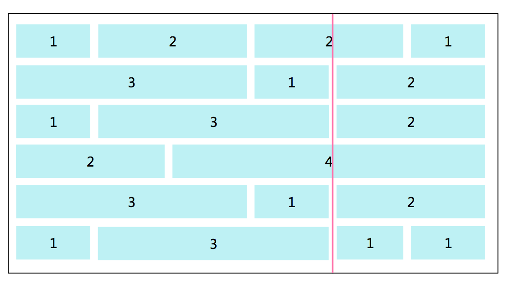

在一个自由之路的游戏中，来了一群人，他们要组队打游戏，他们之间有些互相为朋友，但有些不是，他们之间的朋友关系有传递性，
比如，如果A是B的直接的朋友，B又是C的直接朋友，那么A是C的间接朋友，只要有直接关系或者间接关系的我们都认为在一个朋友圈里
可以组成一队，我们来算一下，在来的这群人中，可以组成几队？
我们给一个N＊N的矩阵 名字叫M，来代表这群人之间的关系，如果M[i][j]=1,则代表第i个人和第j个人是直接的朋友关系，否则不是，
你来输出在这个所有的人中，一共可以组成几个队

例如：
［［1，1，0］，［1，1，0］，［0，0，1］］

M［1］［1］＝1
M［1］［2］＝1
M［1］［3］＝0
＝＝代表第一个人和第二个人是朋友，但和第三人不是朋友

M［2］［1］＝1
M［2］［2］＝1
M［2］［3］＝0
＝＝代表第二个人和第一个人是朋友，但和第三人不是朋友

M［3］［1］＝0
M［3］［2］＝0
M［3］［3］＝1
＝＝代表第三个人和第一个和第二个人不是朋友

所以这里需要组成2队，第一个人和第二个人是直接的朋友，但是第三个人不是他们的朋友，第三个人只能自己组队。


```c++
#include <iostream>
#include <vector>
#include <numeric>
#include <limits>

using namespace std;

int findCircleNum(vector < vector < int > > M) {
	int N = M.size();
	vector<int> team(N);
	for (int i = 0; i < N; i++)
		team.push_back(0);
	int teamNum = 1;
	for (int i = 0; i < N; i++) {
		if (team[i] == 0) team[i] = teamNum++;
		for (int j = i; j < N; j++) {
			if (M[i][j] == 1) {
				if (team[j] == 0)
					team[j] = team[i];
			}
		}
	}
	return teamNum - 1;

}

int main() {
	int res;

	int _M_rows = 0;
	int _M_cols = 0;
	cin >> _M_rows >> _M_cols;
	vector< vector < int > > _M(_M_rows);
	for (int _M_i = 0; _M_i<_M_rows; _M_i++) {
		for (int _M_j = 0; _M_j<_M_cols; _M_j++) {
			int _M_tmp;
			cin >> _M_tmp;
			_M[_M_i].push_back(_M_tmp);
		}
	}
	
	res = findCircleNum(_M);
	cout << res << endl;

	return 0;
}
```


小明的叔叔是建筑师，一天在院子里用高度相同，宽度不同的砖砌了一面墙，墙整体呈长方形，由一行一行的砖叠加而成，叔叔希望小明能帮个忙，帮忙从墙顶到墙底划一条垂直的线，要求这条线穿过最少的砖数。

说明：

1.砖墙用一个二维队列表示，第一维队列中的整数表示不同宽度的砖（数值表示砖的宽度），队列中的数的顺序表示，从左到右排列的砖块，二维队列表示一行一行的砌好的砖层

2.如果划的线穿过砖的边缘，就认为没有穿过砖块，但是划的线不能出现在墙的两侧（此时穿过的砖数为0）。

3.要求找出最少通过的砖数

例如：

**输入:** 

[[1,2,2,1],

 [3,1,2],

 [1,3,2],

 [2,4],

 [3,1,2],

 [1,3,1,1]]

**输出:** 2

解释：**如图，上面的二维队列表示6层砖层砌成的墙，第一层是由宽度为1，2，2，1的砖砌成，第二层是由宽度为3，1，2的砖砌成，以此类推，需要从墙顶到墙底划一条垂直的线，要求这条线穿过最少的砖数。并找出最小的砖数，此时通过了的砖数为2，如图，所以输出为2**

