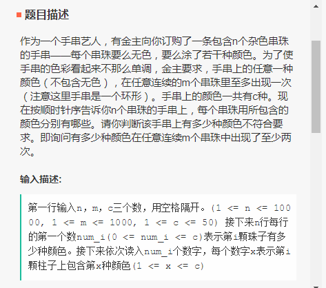
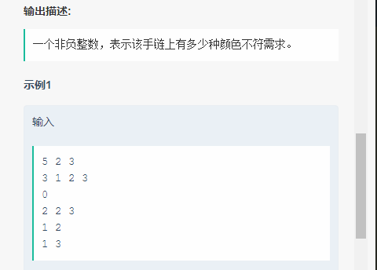
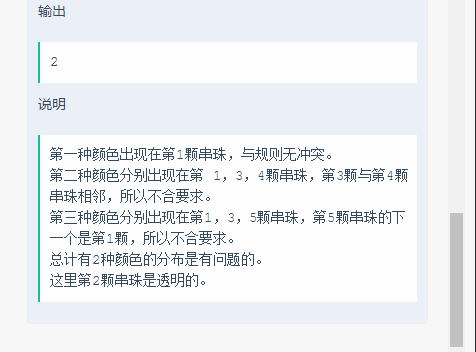
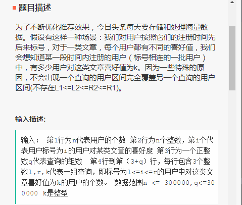
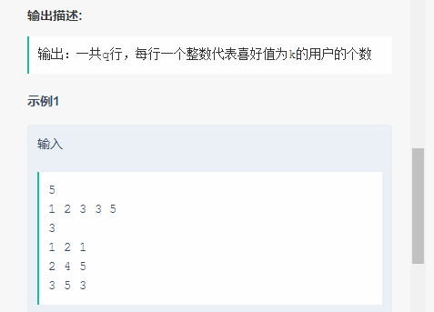
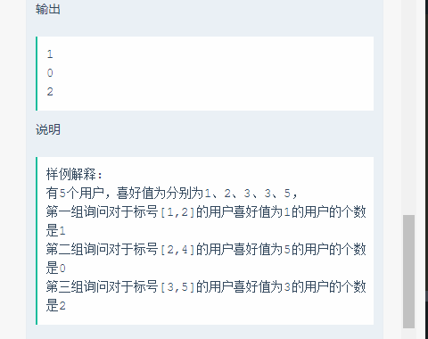

```c++
//1，通过率30%
#include <iostream>
#include <cstring>
#include <cstdio>
#include <cstdlib>
#include <vector>
#include <algorithm>
using namespace std;

int main()
{
	int n, c, m;
	cin >> n >> m >> c;
	//init
	vector<vector <int>> status(c + 1);
	for (int i = 0; i <= c; i++)
		status[i].resize(n + 1);
	int num_i, color;
	for (int i = 1; i <= n; i++) {	
		cin >> num_i;
		for (int j = 0; j < num_i; j++) {
			cin >> color;
			status[color][i] = 1;
		}
	}
	for (int i = 1; i <= c; i++)
		status[i][0] = status[i][n];
	int sum = 0, count = 0;
	for (int i = 1; i < c; i++) {
		for (int j = 1; j <= n; j++) {
			for (int k = 0; k < m; k++) {
				sum += status[i][(j + k) % n];
			}
			if (sum > 1) {
				count++;
				sum = 0;
				break;
			}
			else
				sum = 0;
		}
	}
	cout << count;
	return 0;
}
```








```c++
//2，通过率50%，效率问题
#include <iostream>
#include <cstring>
#include <cstdio>
#include <cstdlib>
#include <vector>
#include <algorithm>
using namespace std;

int main()
{
	int n;
	cin >> n;
	int *like_score = new int[n];
	for (int i = 0; i < n; i++)
		cin >> like_score[i];
	int q;
	cin >> q;
	int l, r, k;
	while (q--) {
		cin >> l >> r >> k;
		int count = 0;
		for (int i = l - 1; i < r; i++) {
			if (like_score[i] == k)
				++count;
		}
		cout << count << endl;
	}
	return 0;
}
```

