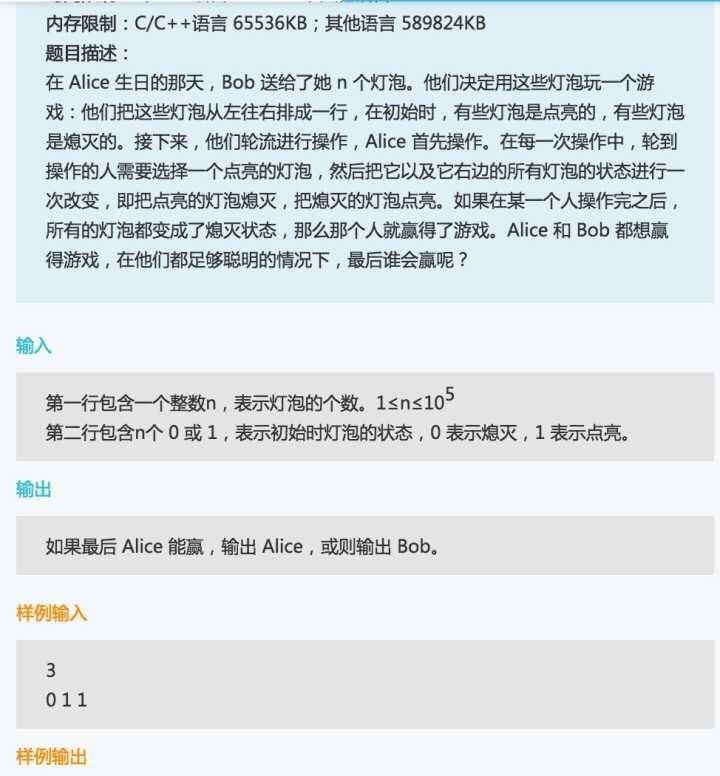

```c++
//过了70%测试用例

#include <iostream>
#include <vector>

using namespace std;

int main()
{
	int n;
	cin >> n;
	vector<int> light(n);
	for (int i = 0; i < n; i++)
		cin >> light[i];
	int count = 0;
	for (int i = 1; i < n - 1; i++) {
		if (light[i] == 0 && light[i + 1] == 1)
			++count;
	}
	if (light[n - 1] == 0 && n - 2 >= 0 && light[n - 2] == 0) count++;
	cout << count;
	if (light[0] == 0 && light[n - 1] == 1) {
		if (count % 2 == 0)
			cout << "Alice" << endl;
		else
			cout << "Bob" << endl;
	}
	else if (light[0] == 0 && light[n - 1] == 0) {
		if (count % 2 == 0)
			cout << "Bob" << endl;
		else
			cout << "Alice" << endl;
	}
	else if (light[0] == 1 && light[n - 1] == 0) {
		if (count % 2 == 0)
			cout << "Alice" << endl;
		else
			cout << "Bob" << endl;
	}
	else if (light[0] == 1 && light[n - 1] == 1) {
		if (count % 2 == 0)
			cout << "Bob" << endl;
		else
			cout << "Alice" << endl;
	}
	else if (light[0] == 1 && count == 0)
		cout << "Alice" << endl;
	else if (light[0]==1 && count == 1)
		cout << "Alice" << endl;
	return 0;
}
```

