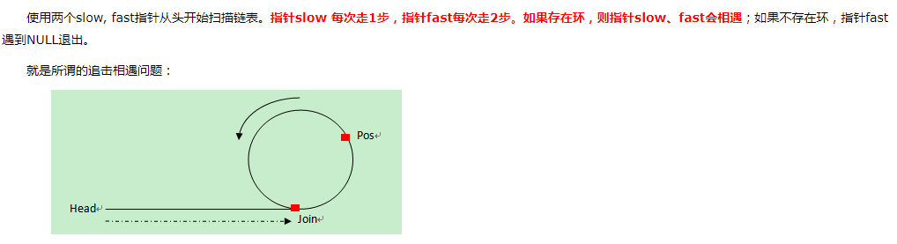
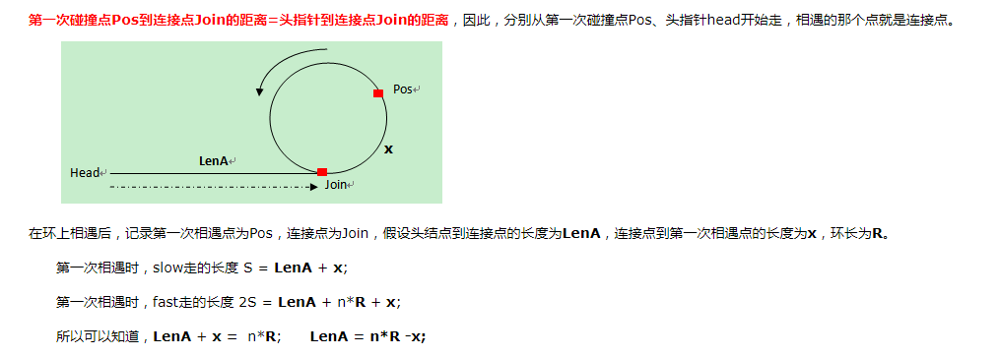
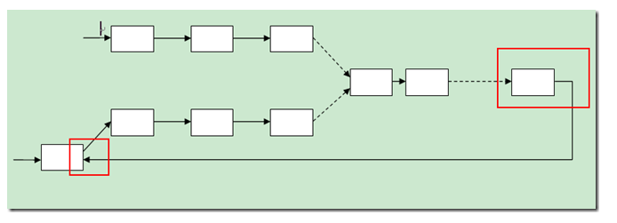
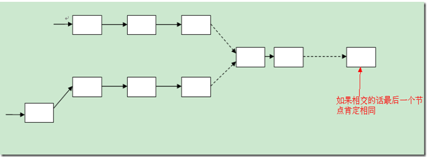

**判断单链表有无环**



```c++
bool IsExistLoop(ListNode *pHead)
{
  ListNode *slow = pHead, *fast =pHead;
  while(fast && fast->next)
  {
    slow = slow->next;
    fast = fast->next->next;
    if(slow == fast)
    	break;
  }
  if(fast == NULL || fast->next == NULL)
    return false;
  else
  	return true;
}
```


**判断环的长度**

第一次相遇（超一圈）时开始计数，第二次相遇时停止计数。

```c++
int LoopLength(ListNode *pHead)
{
  if(!IsExistLoop(*pHead))
  	return 0;
  ListNode *slow = pHead, *fast = pHead;
  int length = 0;
  bool begin = false;
  bool again = false;
  while(fast && fast->next)
  {
    fast = fast->next->next;
    slow = slow->next;
    //超两圈后停止计数
    if(fast == slow && again)
      break;
    //超一圈后开始计数
    if(fast == slow && !again)
    {
      begin = true;
      again = true;
    }
    //计数
    if(begin)
      ++length;
  }
  return length;
}
```


**求环的入口点**



这说明：从头结点到入口的距离，等于转了n圈以后，相遇点到入口的距离。因此，我们可以在链表头、相遇点各设一个指针，每次各走一步，两个指针必定相遇，且相遇第一点为环入口点。

```c++
ListNode* FindLoopEntry(listNode *pHead)
{
  ListNode* fast = pHead, *slow = pHead;
  while(fast && fast->next)
  {
    fast = fast->next->next;
    slow = slow->next;
    //此时fast指向Pos位置
    if(slow == fast)
    	break;
  }
  if(fast == NULL || fast->next == NULL)
  	return NULL;
  slow = pHead;
  while(slow != fast)
  {
    slow = slow->next;
    fast = fast->next;
  }
  return slow;
}
```


**判断两个单链表是否相交**

思路：

1、碰到这个问题，第一印象是采用hash来判断，将两个链表的节点进行hash，然后判断出节点，这种想法当然是可以的。

2、当然采用暴力的方法也是可以的，遍历两个链表，在遍历的过程中进行比较，看节点是否相同。

3、先遍历第一个链表到他的尾部，然后将尾部的next指针指向第二个链表(尾部指针的next本来指向的是null)。这样两个链表就合成了一个链表，判断原来的两个链表是否相交也就转变成了判断新的链表是否有环的问题了：即判断单链表是否有环？

这样进行转换后就可以从链表头部进行判断了，其实并不用。通过简单的了解我们就很容易知道，如果新链表是有环的，那么原来第二个链表的头部一定在环上。因此我们就可以从第二个链表的头部进行遍历的，从而减少了时间复杂度(减少的时间复杂度是第一个链表的长度)。



这种方法可以判断两个链表是否相交，但不太容易找出他们的交点。

4、仔细研究两个链表，如果他们相交的话，那么他们最后的一个节点一定是相同的，否则是不相交的。因此判断两个链表是否相交就很简单了，分别遍历到两个链表的尾部，然后判断他们是否相同，如果相同，则相交；否则不相交。示意图如下：



如何寻找交叉节点:

指针p、q分别遍历链表a、b，假设q先到达NULL（即 假设a 比 b 长），此时从a的头发出一个指针t,当p到达NULL时,从b的头发出s,当s==t的时候即交点.

```c++
bool IsIntersect(ListNode *a, ListNode *b)
{
  //其中一个为空链表，必然不相交
  ListNode *pa = a, *pb = b;
  if(!pa || !pb) 
  	return false;
  for(;pa->next; pa = pa->next);	//遍历a链表至最后一个节点
  for(;pb->next; pb = pb->next);	//遍历b链表至最后一个节点
  return pa == pb ? true : false;	//相等，则相交，否则不相交
}

ListNode* FindIntersectNode(ListNode *a, ListNode *b)
{
  if(!IsIntersect(a,b))
  	return NULL;
  ListNode *pa = a, *pb = b, *k, *t, *s;
  //其中一个链表遍历至NULL
  for(; pa && pb; pa = pa->next, pb = pb->next);
  
  k = (pa == 0)?pb:pa;	//记录没有到达NULL的链表的指针位置
  t = (pa == 0)?b:a;	
  s = (pa == 0)?a:b;
  for(; k; k = k-next, t = t->next);
  for(; t != s; t = t->next, s = s->next);
  return t;
}
```


https://github.com/hit9/oldblog/blob/gh-pages/blog-src/blog/C/posts/25.mkd链表相关