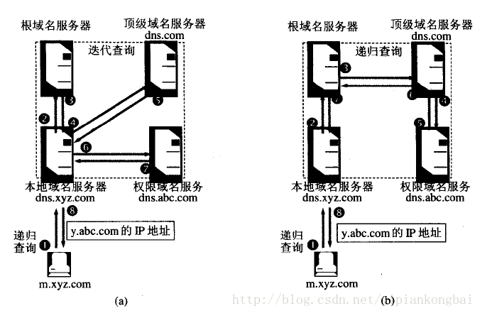

##### 什么是DNS？

​	DNS（Domain Name System）是”域名系统“的英文缩写，用于TCP/IP网络，提供将主机名或域名转换为IP地址的服务。因为网络在处理数据报时，使用的是IP地址而不是域名，因此需要将我们提供的主机名/域名”翻译“成所对应的IP地址。

​	**DNS基于UDP服务，使用53号端口。该服务一般不直接为用户使用，而是为其他应用服务，例如HTTP，SMTP等在其中需要完成主机名到IP地址的转换。**

##### DNS解析过程

​	有两种查询方式：**递归查询**、**迭代查询**。

* **递归查询**：一般为主机---->本地域名服务器。
  * 如果主机所询问的本地域名服务器不知道被查询的域名的IP，那么本地域名服务器就以DNS客户的身份，向其他根域名服务器继续发出查询请求（即代替主机继续查询）。
  * 递归查询的返回结果：所要查询的IP地址或报错（即无法查询到对应的IP地址）。
* **迭代查询**：本地域名服务器---->根域名服务器。
  * 根域名服务器收到本地域名服务器发出的查询请求时，要么给出所要查询的IP地址，要么告诉本地域名服务器：“下一步应该向哪个域名服务器发出查询请求“，然后让本地域名服务器进行后续查询。
  * 根域名服务器通常是把自己知道的顶级域名服务器的IP地址告诉本地域名服务器，让本地域名服务器再向顶级域名服务器查询。顶级域名服务器在收到本地域名服务器的查询请求后，要么给出所要查询的IP地址，要么告诉本地服务器下一步应当向哪一个权限域名服务器进行查询。最后，直到得到所需的IP地址或者报错，并将结果返回给发起查询的主机。

在DNS客户机发起查询时，发送的每条查询信息都包括三条内容：

* 指定的DNS域名
* 指定的查询类型
* DNS域名的指定类别（始终为Internet类别）

为什么需要有4个DNS服务器？

如上图，根据整个查询过程，需要本地域名服务器、根域名服务器、顶级域名服务器、权限域名服务器共4个DNS服务器。