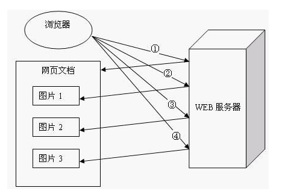
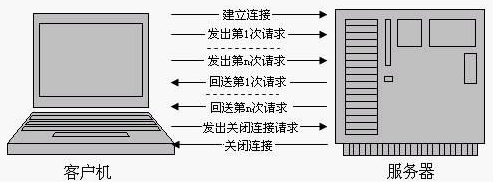

##### HTTP1.1状态代码

| 状态代码 | 状态信息                       | 含义                                       |
| ---- | -------------------------- | ---------------------------------------- |
| 100  | continue                   | 初始的请求已经接受，客户应当继续发送请求的其余部分。（HTTP 1.1新）    |
| 200  | ok                         | 请求被正常处理                                  |
| 202  | accept                     | 已经接受请求，但处理尚未完成                           |
| 204  | no content                 | 请求被受理但没有资源可以返回                           |
| 206  | Partial Content            | 客户端只是请求资源的一部分，服务器只对请求的部分资源执行GET方法，相应报文中通过Content-Range指定范围的资源 |
| 301  | Moved Permanently          | 永久性重定向（旧地址的资源永久失效，不可访问）                  |
| 302  | Found                      | 临时重定向（旧地址资源还在，仍可以访问，服务器返回的头部信息中会包含一个 Location 字段，内容是重定向到的url） |
| 303  | See Other                  | 与302类似，只是在客户端请求一个URI的时候，通过GET方法重定向到另一个URI |
| 304  | Not Modified               | 发送附带条件的请求时，条件不满足时返回，与重定向无关               |
| 307  | Temporary Redirect         | 临时重定向，与302类似，强制要求使用                      |
| 400  | Bad Request                | 请求报文语法有误，服务器无法识别                         |
| 401  | Unauthorized               | 客户试图未经授权访问受密码保护的页面                       |
| 403  | Forbidden                  | 请求的资源禁止被访问                               |
| 404  | Not Found                  | 无法找到指定位置的资源                              |
| 500  | Internal Server Error      | 服务器内部错误，为了完成请求访问下一个服务器，但该服务器返回了非法的应答     |
| 502  | Bad Gateway                | 服务器作为网关或者代理时                             |
| 503  | Service Unavailable        | 服务器忙                                     |
| 504  | Gateway Timeout            | 由作为代理或网关的服务器使用，表示不能及时地从远程服务器获得应答         |
| 505  | HTTP Version Not Supported | 服务器不支持请求中所指明的HTTP版本                      |

##### HTTP请求方法（前3种为HTTP1.0定义的，后5种为HTTP1.1新增的）

* GET：请求指定的页面信息，并返回实体主体。
* HEAD：类似于get请求，只不过返回的响应中没有主体的内容，用于获取报头。
* POST：向指定资源提交数据进行处理请求（例如提交表单或者上传文件）。数据被包含在请求体中。POST请求可能会导致新的资源的建立和/或已有资源的修改。
* PUT：从客户端向服务器传送的数据取代指定的文档的内容。
* DELETE：请求服务器删除指定的页面。
* CONNECT：HTTP/1.1协议中预留给能够将连接改为管道方式的代理服务器。
* OPTIONS：允许客户端查看服务器的性能。
* TRACE：回显服务器收到的请求，主要用于测试或诊断。

##### HTTP1.0和HTTP1.1的区别

* HTTP 1.0规定浏览器与服务器只保持短暂的连接，浏览器的每次请求都需要与服务器建立一个TCP连接，服务器完成请求处理后立即断开TCP连接，服务器不跟踪每个客户也不记录过去的请求。

  但是，这也造成了一些性能上的缺陷，例如，一个包含有许多图像的网页文件中并没有包含真正的图像数据内容，而只是指明了这些图像的URL地址，当WEB浏览器访问这个网页文件时，浏览器首先要发出针对该网页文件的请求，当浏览器解析WEB服务器返回的该网页文档中的HTML内容时，发现其中的图像标签后，浏览器将根据标签中的src属性所指定的URL地址再次向服务器发出下载图像数据的请求。

  访问一个包含有许多图像的网页文件的整个过程包含了多次请求和响应，每次请求和响应都需要建立一个单独的连接，每次连接只是传输一个文档和图像，上一次和下一次请求完全分离。即使图像文件都很小，但是客户端和服务器端每次建立和关闭连接却是一个相对比较费时的过程，并且会严重影响客户机和服务器的性能。

  

* HTTP 1.1支持持久连接，在一个TCP连接上可以传送多个HTTP请求和响应，减少了建立和关闭连接的消耗和延迟。一个包含有许多图像的网页文件的多个请求和应答可以在一个连接中传输，但每个单独的网页文件的请求和应答仍然需要使用各自的连接。HTTP 1.1还允许客户端不用等待上一次请求结果返回，就可以发出下一次请求，但服务器端必须按照接收到客户端请求的先后顺序依次回送响应结果，以保证客户端能够区分出每次请求的响应内容，这样也显著地减少了整个下载过程所需要的时间。

  

* HTTP 1.1增加host字段。在HTTP1.0中认为每台服务器都绑定一个唯一的IP地址，因此，请求消息中的URL并没有传递主机名。但随着虚拟主机技术的发展，在一台物理服务器上可以存在多个虚拟主机，并且它们共享一个IP地址。在HTTP 1.1中增加Host请求头字段后，WEB浏览器可以使用主机头名来明确表示要访问服务器上的哪个WEB站点，这才实现了在一台WEB服务器上可以在同一个IP地址和端口号上使用不同的主机名来创建多个虚拟WEB站点。

* HTTP 1.1的持续连接，也需要增加新的请求头来帮助实现，例如，Connection请求头的值为Keep-Alive时，客户端通知服务器返回本次请求结果后保持连接；Connection请求头的值为close时，客户端通知服务器返回本次请求结果后关闭连接。

* HTTP/1.1加入了一个新的状态码100（Continue）。客户端事先发送一个只带头域的请求，如果服务器因为权限拒绝了请求，就回送响应401（Unauthorized）；如果服务器接收此请求就回送响应码100，客户端就可以继续发送带实体的完整请求了。100 (Continue) 状态代码的使用，允许客户端在发request消息body之前先用request header试探一下server，看server要不要接收request body，再决定要不要发request body。

* HTTP 1.1还提供了与身份认证、状态管理和Cache缓存等机制相关的请求头和响应头。

* HTTP/1.0不支持文件断点续传，HTTP/1.1支持文件断点续传。RANGE:bytes是HTTP/1.1新增内容，HTTP/1.0每次传送文件都是从文件头开始，即0字节处开始。RANGE:bytes=XXXX表示要求服务器从文件XXXX字节处开始传送，这就是我们平时所说的断点续传！

##### GET和POST的区别

GET和POST本质上都是TCP连接，由于HTTP的规定和浏览器/服务器的限制，导致他们在应用过程中体现出一些不同（参数位置，长度限制等）。

简单的说：GET产生一个TCP数据包;POST产生两个TCP数据包。

- 对于GET方式的请求，浏览器会把http header和data一并发送出去，服务器响应200(返回数据)。
- 而对于POST，浏览器先发送header，服务器响应100 continue，浏览器再发送data，服务器响应200 ok(返回数据)。

##### HTTP和HTTPS的区别

