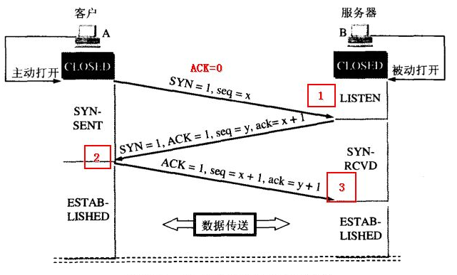
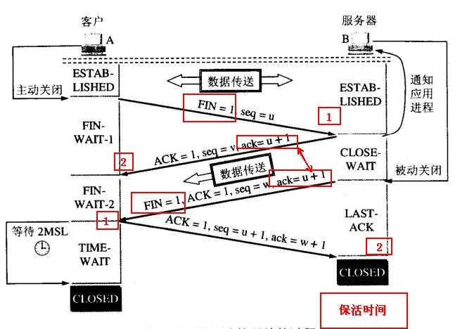

##### TCP三次握手（建立连接）

* 第一步：客户端发出连接请求，发送SYN = 1以及序列号 seq = x
* 第二步：服务器收到连接请求，进行回复确认，向客户端发送 SYN = 1，ACK = 1，seq = y，ack = x + 1
* 第三步：客户端进行再一次的确认，回复ACK = 1，seq = x + 1，ack = y + 1

> 为什么要采用三次握手，而不是两次握手？（即为什么要进行两次确认）
>
> * 采用三次握手是为了防止客户端发送的失效的连接请求报文突然又传送到服务器，因而产生错误。失效的连接请求报文段是指：客户端A发出的连接请求没有收到服务器B的确认，于是经过一段时间后，客户端A又重新向服务器B发送连接请求，且建立成功，顺序完成数据传输。考虑这样一种特殊情况，客户端A第一次发送的连接请求并没有丢失，而是因为网络节点导致延迟达到服务器B，服务器B以为是客户端A又发起的新连接，于是服务器B同意连接，并向客户端A发回确认，但是此时客户端A根本不会理会，服务器B就一直在等待客户端A发送数据，导致服务器B的**资源浪费**。

##### TCP四次挥手（断开连接）

* 第一步：客户端A（主动关闭方）发送FIN = 1、seq = u，用来关闭主动方到被动关闭方的数据传送，即客户端A不再发送数据（**但仍然可以接受数据**）。
* 第二步：服务器B（被动关闭方）收到FIN包后，发送ACK = 1、seq = v、ack = u + 1给客户端A，确认收到释放连接请求。
* 第三步：A收到B的确认后进入等待状态，等待B请求释放连接， B数据发送完成后就向A请求连接释放，也是发送FIN = 1、seq = w、ack = u + 1，用来关闭被动关闭方到主动关闭方的数据传送。
* 第四步：A收到FIN后，发送ACK = 1、seq = u + 1、ack = w + 1给B，确认收到释放链接请求。至此，完成四次挥手。

> 为什么TCP断开连接要四次挥手？
>
> * TCP是全双工模式，接收到FIN时意味着将没有数据再发来，但还是可以	继续发送数据。对于A（客户端）、B（服务器）双方，每一方都要进行发送FIN释放连接请求以及确认对方的释放连接请求，因此共需要4次。
>
> 
>
> 为什么要设置TIME_WAIT？
>
> * B向A发送 FIN = 1 的释放连接请求，A需要回复ACK，如果这个ACK包丢失，B没有收到ACK包，会进行超时重传，这样A在TIME_WAIT还能够接受到B重发的FIN包，并对其进行确认回复。（A收到FIN请求后，TIME_WAIT会重新计时）。
>
> 
>
> 大量TIME_WAIT产生的原因及解决办法。
>
> * 原因：对于基于TCP的HTTP协议，关闭TCP连接的是Server端，这样，Server端会进入TIME_WAIT状态，可想而知，对于访问量大的Web Server，会存在大量的TIME_WAIT状态。
> * 解决办法：
>   * 开启socket重用，允许将TIME_WAIT的socket重新用于TCP连接
>   * 开启快速回收

